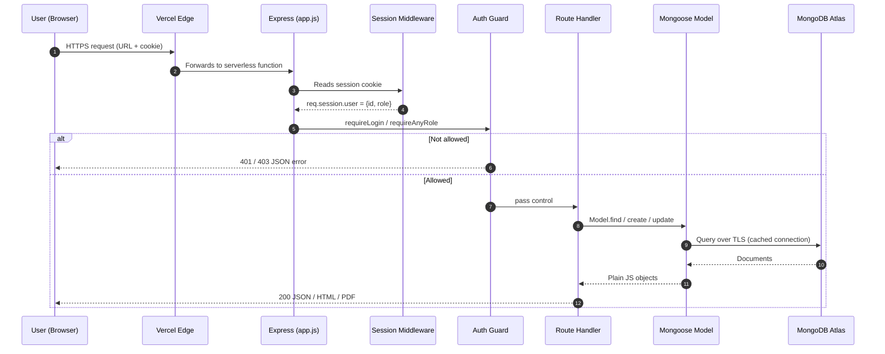
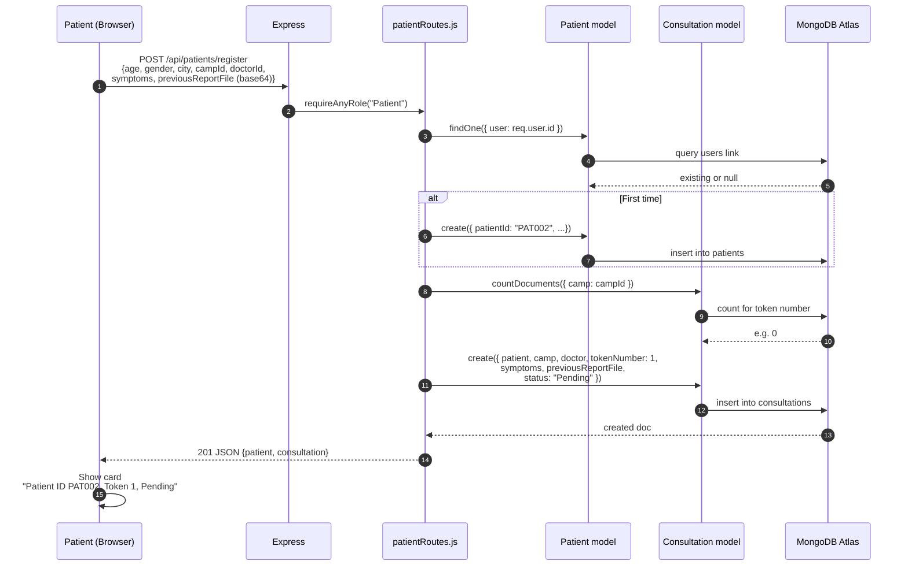
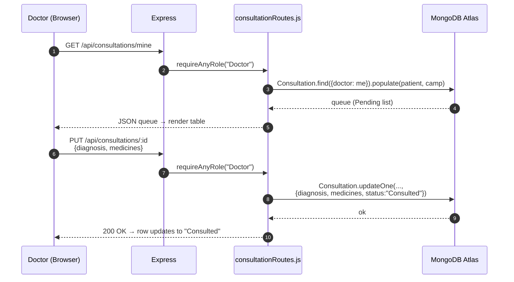
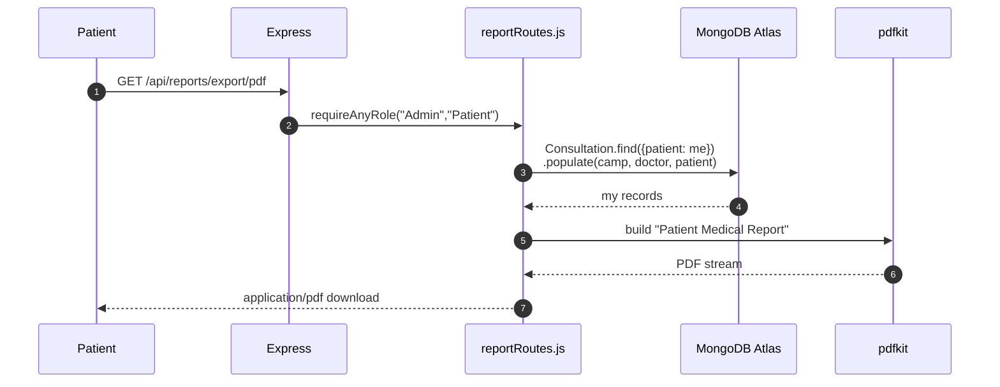
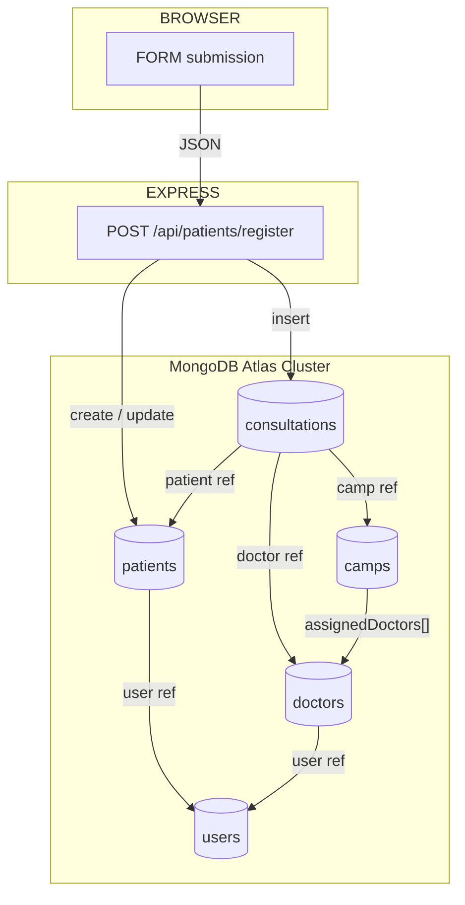
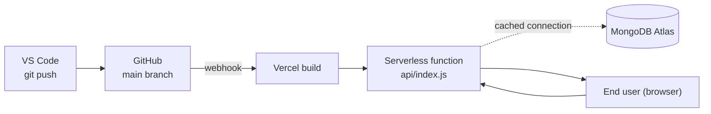

# System Architecture & Real-Time Flow

How the Smart Health Camp app actually works end-to-end — from browser click to MongoDB and back.

---

## 1. High-Level Architecture (3-tier)

```mermaid
flowchart LR
    subgraph CLIENT["BROWSER (Client)"]
        L["landing.html"]
        A["auth.html"]
        AD["admin.html"]
        R["register.html"]
        C["consultation.html"]
        RP["reports.html"]
        JS["main.js / auth.js<br/>fetch() calls"]
        CSS["style.css"]
    end

    subgraph SERVER["VERCEL SERVERLESS (Node.js + Express)"]
        APP["app.js<br/>(Express app)"]
        SESS["express-session<br/>(cookie)"]
        MW["middleware/auth.js<br/>requireLogin / requireAnyRole"]
        ROUTES["routes/*.js<br/>auth | camps | doctors |<br/>patients | consultations | reports"]
        MODELS["models/*.js<br/>Mongoose schemas"]
        DBJS["config/db.js<br/>cached connection"]
    end

    subgraph CLOUD["MONGODB ATLAS (Cloud)"]
        DB[("MongoDB<br/>5 collections")]
    end

    CLIENT -- "HTTPS<br/>fetch JSON" --> APP
    APP --> SESS --> MW --> ROUTES --> MODELS --> DBJS
    DBJS -- "TLS connection<br/>(cached)" --> DB
    DB -- "documents" --> MODELS --> ROUTES -- "JSON response" --> CLIENT
```

---

## 2. The 3 Layers in Plain Words

| Layer | What it is | Files |
|---|---|---|
| **Presentation** | HTML pages + CSS + browser JavaScript | `Frontend/views/*.html`, `Frontend/public/css/style.css`, `Frontend/public/js/*.js` |
| **Application** | Express server: routes, middleware, business rules | `Backend/app.js`, `Backend/routes/*.js`, `Backend/middleware/auth.js` |
| **Data** | MongoDB Atlas (cloud) accessed through Mongoose | `Backend/models/*.js`, `Backend/config/db.js` |

---

## 3. Request Lifecycle — what happens on every click

---

## 4. Real-Time User Journeys

### 4.1 Patient registers for a camp

### 4.2 Doctor consults patient

### 4.3 Patient downloads PDF report

---

## 5. Where each piece of data lives (storage map)

---

## 6. Deployment — from your laptop to the world

Steps:
1. `git push origin main` from VS Code.
2. GitHub fires a webhook to Vercel.
3. Vercel runs `npm install` and bundles `Backend/` + `Frontend/` files.
4. Vercel publishes a new serverless function at `api/index.js`.
5. Every URL is rewritten to that function via `vercel.json`.
6. The function imports `Backend/app.js`, opens (or reuses) the cached MongoDB connection, and serves the request.

---

## 7. Security & Reliability Layers (top to bottom)

| Layer | What it does |
|---|---|
| HTTPS (Vercel) | Encrypts everything in transit |
| HTTP-only session cookie | Browser cannot read it via JS |
| express-session | Server-side session store |
| bcryptjs | Passwords hashed, never plain text |
| requireLogin / requireAnyRole | Role-based access control on every API |
| Cache-Control: no-store on protected HTML | Back button cannot restore a logged-in page |
| pageshow bfcache listener | Auto-logout when browser restores from cache |
| Referential integrity check | Camps with registrations cannot be deleted |
| Mongoose schema validation | Bad data is rejected before insert |
| MongoDB Atlas Network Access | TLS + IP whitelist |

---

## 8. One-line summary to say in the demo

> "The browser sends an HTTPS request → Vercel routes it to our Express serverless function → middleware checks the session cookie and role → the matching route handler uses Mongoose to read or write documents in MongoDB Atlas over a cached TLS connection → the response goes back as JSON, HTML, CSV, or PDF. Five collections — users, patients, doctors, camps, consultations — store everything, and `consultations` is the junction that links Patient, Camp, and Doctor."
