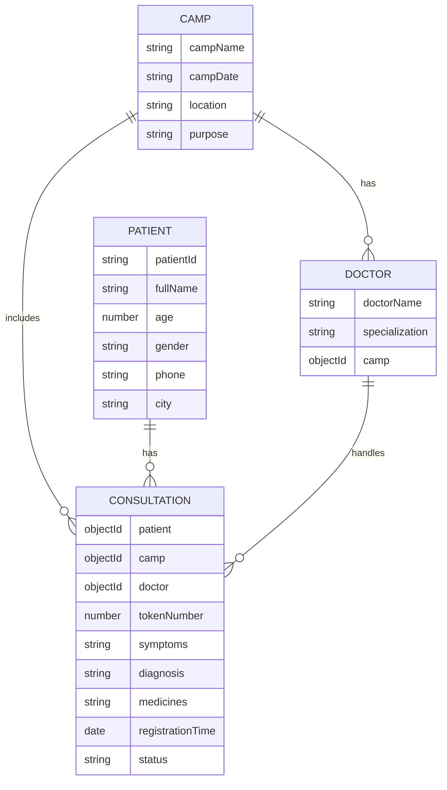

# ER Diagram

```mermaid
erDiagram
    CAMP ||--o{ DOCTOR : has
    CAMP ||--o{ CONSULTATION : includes
    PATIENT ||--o{ CONSULTATION : has
    DOCTOR ||--o{ CONSULTATION : handles

    CAMP {
        string campName
        string campDate
        string location
        string purpose
    }

    DOCTOR {
        string doctorName
        string specialization
        objectId camp
    }

    PATIENT {
        string patientId
        string fullName
        number age
        string gender
        string phone
        string city
    }

    CONSULTATION {
        objectId patient
        objectId camp
        objectId doctor
        number tokenNumber
        string symptoms
        string diagnosis
        string medicines
        date registrationTime
        string status
    }
```

Simple explanation:

- One camp can have many doctors.
- One camp can have many consultations.
- One patient can have many consultations.
- One doctor can handle many consultations.
