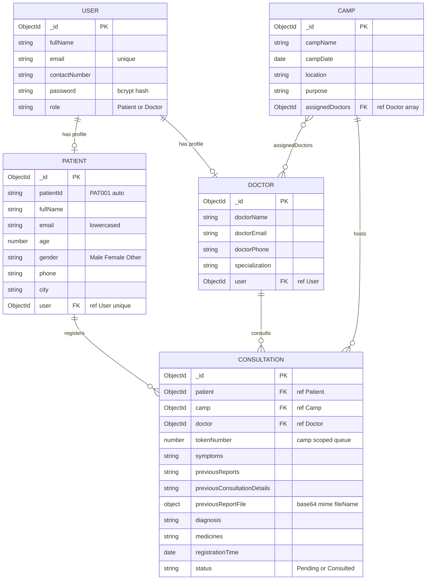

# Entity–Relationship Diagram

Smart Health Camp Registration & Reporting System uses **5 MongoDB collections**.
This document shows the entities, their attributes, and the relationships between them.

---

## 1. Visual ER Diagram



> If your Markdown viewer does not render Mermaid, see the ASCII version at the bottom of this file.

---

## 2. Entity Tables

### 2.1 USER  (`users` collection)

Stores login accounts for Patients and Doctors. Admin is hard-coded and NOT stored here.

| Field | Type | Constraint | Purpose |
|---|---|---|---|
| _id | ObjectId | Primary Key | Auto-generated |
| fullName | String | required | Display name |
| email | String | required, unique, lowercased | Login identifier |
| contactNumber | String | required | Phone |
| password | String | required | bcrypt hashed |
| role | String enum | Patient or Doctor | Drives role-based access |
| doctorId | ObjectId | optional, ref: Doctor | Set for Doctor accounts |
| createdAt / updatedAt | Date | auto | Mongoose timestamps |

### 2.2 PATIENT  (`patients` collection)

Patient profile created the first time a user registers for a camp.

| Field | Type | Constraint | Purpose |
|---|---|---|---|
| _id | ObjectId | Primary Key | Auto-generated |
| patientId | String | unique, format PAT001 | Human-readable ID |
| fullName | String | required | Copied from User |
| email | String | required, lowercased | Copied from User |
| age | Number | required | For age-group analytics |
| gender | String enum | Male, Female, Other | For gender analytics |
| phone | String | required | Contact |
| city | String | required | For location grouping |
| user | ObjectId | required, unique, ref: User | 1-to-1 link to login |
| createdAt / updatedAt | Date | auto | Mongoose timestamps |

### 2.3 DOCTOR  (`doctors` collection)

Doctor profile created at Doctor self-registration.

| Field | Type | Constraint | Purpose |
|---|---|---|---|
| _id | ObjectId | Primary Key | Auto-generated |
| doctorName | String | required | Display name |
| doctorEmail | String | required, lowercased | Communication |
| doctorPhone | String | required | Communication |
| specialization | String | required | Cardiologist, Eye Specialist, etc. |
| user | ObjectId | required, ref: User | 1-to-1 link to login |
| createdAt / updatedAt | Date | auto | Mongoose timestamps |

### 2.4 CAMP  (`camps` collection)

Scheduled health camp event created by Admin.

| Field | Type | Constraint | Purpose |
|---|---|---|---|
| _id | ObjectId | Primary Key | Auto-generated |
| campName | String | required | Eye Camp, Heart Camp, etc. |
| campDate | Date | required | Scheduled date |
| location | String | required | Venue |
| purpose | String | optional | Theme / focus |
| assignedDoctors | ObjectId[] | ref: Doctor | Many-to-many bridge with Doctor |
| createdAt / updatedAt | Date | auto | Mongoose timestamps |

### 2.5 CONSULTATION  (`consultations` collection) — the junction entity

Every patient camp-registration creates one consultation document.
This is the central linking collection that joins Patient, Camp, and Doctor.

| Field | Type | Constraint | Purpose |
|---|---|---|---|
| _id | ObjectId | Primary Key | Auto-generated |
| patient | ObjectId | required, ref: Patient | Who registered |
| camp | ObjectId | required, ref: Camp | Which camp |
| doctor | ObjectId | required, ref: Doctor | Which doctor |
| tokenNumber | Number | required, camp-scoped | Queue position, resets per camp |
| symptoms | String | optional | Patient input |
| previousReports | String | optional | Patient input |
| previousConsultationDetails | String | optional | Patient input |
| previousReportFile.data | String | optional | Base64-encoded file |
| previousReportFile.mimeType | String | optional | application/pdf, image/jpeg |
| previousReportFile.fileName | String | optional | Original filename |
| diagnosis | String | optional | Set by Doctor |
| medicines | String | optional | Set by Doctor |
| registrationTime | Date | default Date.now | Used for date filters |
| status | String enum | Pending or Consulted | Lifecycle flag |
| createdAt / updatedAt | Date | auto | Mongoose timestamps |

---

## 3. Relationship Summary

| From | Cardinality | To | Implementation | Meaning |
|---|---|---|---|---|
| User | 1 — 1 | Patient | `Patient.user` unique ref | Each Patient login has one profile |
| User | 1 — 1 | Doctor | `Doctor.user` ref | Each Doctor login has one profile |
| Camp | M — M | Doctor | `Camp.assignedDoctors[]` array of refs | A camp has many doctors; a doctor works in many camps |
| Patient | 1 — M | Consultation | `Consultation.patient` ref | One patient can register for many camps |
| Camp | 1 — M | Consultation | `Consultation.camp` ref | One camp has many patient registrations |
| Doctor | 1 — M | Consultation | `Consultation.doctor` ref | One doctor consults many patients |

> **Why Consultation is the junction collection:** it resolves the natural many-to-many between Patient and Camp, and at the same time records which Doctor handled the case. Without it, you would lose the diagnosis, medicines, token, status, and attached report for each individual visit.

---

## 4. Keys, Constraints, and Integrity Rules

- **Primary Key (PK):** every document has `_id` of type ObjectId, generated by MongoDB.
- **Foreign Key (FK) equivalent:** Mongoose ObjectId fields with `ref: "<Model>"`, resolved using `.populate()` at query time.
- **Uniqueness:**
  - `User.email` is unique → no duplicate accounts.
  - `Patient.patientId` is unique → no duplicate PAT IDs.
  - `Patient.user` is unique → one profile per login.
- **Referential integrity rule:** Camps cannot be deleted while any Consultation references them. The DELETE endpoint checks this and responds with *"Camp cannot be removed because patient registrations already exist."*
- **Token uniqueness within a camp:** tokenNumber is generated by counting existing consultations for the chosen campId and adding 1, giving a per-camp queue starting at 1.

---

## 5. ASCII Fallback Diagram

```
                +-------------+
                |    USER     |
                |   (login)   |
                +------+------+
                       |
        +--------------+--------------+
        | 1                           | 1
        v                             v
  +------------+                +------------+
  |  PATIENT   |                |   DOCTOR   |
  +-----+------+                +-----+------+
        |                             |
        | 1                       M   |  M
        |                             |
        |                       +-----+------+
        |                       |    CAMP    |
        |                       +-----+------+
        |                             |
        |                             | 1
        |       +----------------+    |
        +-----> | CONSULTATION   | <--+
         M     |   (junction)   |
                +-------+--------+
                        |
                        | M
                        v
                     DOCTOR (ref)
```

---

## 6. Example Documents

```jsonc
// users
{
  "_id": "664f0ab1c0f1e9a1d2b30001",
  "fullName": "Kiran",
  "email": "kiran@gmail.com",
  "contactNumber": "7892273348",
  "password": "$2a$10$...bcrypt...",
  "role": "Patient"
}

// patients
{
  "_id": "664f0ab1c0f1e9a1d2b30010",
  "patientId": "PAT002",
  "fullName": "Kiran",
  "email": "kiran@gmail.com",
  "age": 8,
  "gender": "Male",
  "phone": "7892273348",
  "city": "Davangere",
  "user": "664f0ab1c0f1e9a1d2b30001"
}

// doctors
{
  "_id": "664f0ab1c0f1e9a1d2b30020",
  "doctorName": "Dr Lubna",
  "doctorEmail": "lubna@gmail.com",
  "doctorPhone": "9000000000",
  "specialization": "Eye Specialist",
  "user": "664f0ab1c0f1e9a1d2b30002"
}

// camps
{
  "_id": "664f0ab1c0f1e9a1d2b30030",
  "campName": "Eye Camp",
  "campDate": "2026-06-05T00:00:00.000Z",
  "location": "City Hospital",
  "purpose": "Free eye screening",
  "assignedDoctors": ["664f0ab1c0f1e9a1d2b30020"]
}

// consultations  (the junction)
{
  "_id": "664f0ab1c0f1e9a1d2b30040",
  "patient": "664f0ab1c0f1e9a1d2b30010",
  "camp":    "664f0ab1c0f1e9a1d2b30030",
  "doctor":  "664f0ab1c0f1e9a1d2b30020",
  "tokenNumber": 1,
  "symptoms": "fever",
  "previousReports": "na",
  "previousReportFile": {
    "data": "JVBERi0xLjQK...",
    "mimeType": "application/pdf",
    "fileName": "old-report.pdf"
  },
  "diagnosis": "dolo 650",
  "medicines": "dolo 650",
  "registrationTime": "2026-06-05T16:10:24.000Z",
  "status": "Consulted"
}
```
